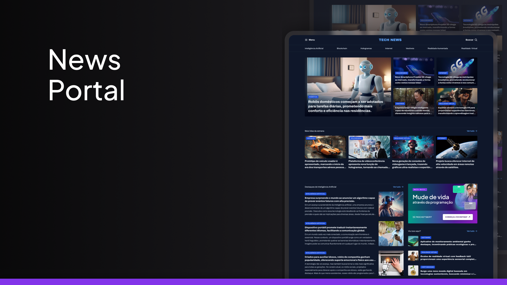

<h1 align="center"> News Portal </h1>

a news portal, reporting on AI and technologies.  

  <a href="#-tecnologias">Technologies</a>&nbsp;&nbsp;&nbsp;|&nbsp;&nbsp;&nbsp;
  <a href="#-Project">Project</a>&nbsp;&nbsp;&nbsp;|&nbsp;&nbsp;&nbsp;
  <a href="#-layout">Layout</a>&nbsp;&nbsp;&nbsp;

 

  

## 🚀 Technologies

This project was developed with the following technologies:

- HTML e CSS
- Git e Github
- Figma

## 💻 Project

Compilation of travel images.

- [Access the finished project online](https://gusfornari.github.io/News-portal/)

## 🔖 Layout

You can view the project layout through [This link](https://www.figma.com/community/file/1362166020452569562/portal-de-noticias). You must have a [Figma](https://figma.com) account to access it.

---

Made with ♥ by Leschiutta :wave: